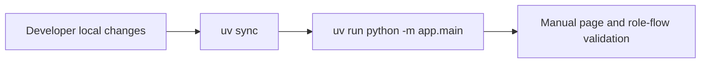

# Architecture - kingshot-scheduler Reference

## Purpose
This repository hosts a NiceGUI-driven web application for Kingshot event coordination. It combines page-level UI routes, FastAPI callback routes for Discord OAuth, in-memory mock data stores, and helper utilities for role-aware filtering and persistence. The architecture is intentionally lightweight and local-first for prototyping.

## System Topology
- Frontend and backend are delivered together via NiceGUI.
- NiceGUI mounts onto FastAPI and serves Python-defined page routes.
- Discord OAuth callback is implemented as a FastAPI route and redirects back into NiceGUI pages.
- Data persistence is currently in-memory module lists (`app/models/sample_data.py`).

## Entry Points
| Entry point | Type | Purpose |
|---|---|---|
| `app/main.py` | Runtime module | Registers page modules, auth callback routes, and starts NiceGUI server |
| `app/pages/*.py` | UI routes | Route handlers for dashboard, accounts, players, events, timeslots, search, admin, auth |
| `app/pages/auth.py` | UI + FastAPI route registration | Registration pages and OAuth callback route binding |

## Tech Stack and Versions
| Package/Tool | Version | Purpose |
|---|---|---|
| Python | >=3.14 | Runtime language |
| nicegui | >=3.16.0 | Unified UI server framework |
| fastapi | >=0.141.1 | Callback and API route support |
| httpx | >=0.28.1 | Async HTTP requests to Discord APIs |
| python-dateutil | >=2.9.0 | Timezone offset helpers |
| python-dotenv | >=1.2.3 | Environment variable loading |

## Build, Run, and Validation
```bash
# Setup
uv sync
cp .env.example .env

# Run local app
uv run python -m app.main
```

## Environment Topology
| Environment variable | Used by | Purpose |
|---|---|---|
| `DISCORD_CLIENT_ID` | `app/auth/discord_oauth.py` | OAuth app identity |
| `DISCORD_CLIENT_SECRET` | `app/auth/discord_oauth.py` | OAuth code exchange |
| `DISCORD_BOT_TOKEN` | `app/auth/discord_guild.py` | Guild membership verification |
| `DISCORD_REDIRECT_URI` | `app/auth/discord_oauth.py` | OAuth callback URI |
| `STORAGE_SECRET` | local runtime convention | NiceGUI storage signing secret (currently hardcoded dev value in `app/main.py`) |

## CI/CD Pipeline
No CI workflow files are present under `.github/workflows/`.



## Cross-Cutting Patterns
- Shared layout composition is centralized in `app/components/layout.py` and called by each page.
- Role visibility logic is centralized in `app/components/role_switcher.py`.
- Filter and table sort persistence use `app/utils/filters.py` + `app/utils/storage.py` backed by `app.storage.user`.
- OAuth and guild membership are split by responsibility: `discord_oauth.py` for identity, `discord_guild.py` for guild membership checks.

## Notes for AI Agents
- Keep run mode module-based from repo root (`python -m app.main`) to preserve `app.*` import behavior.
- Treat sample data lists as mock-only shared state and avoid claiming production persistence.
- Validate all env-sensitive changes against `.env.example` and code usage sites.

## Cross-References
- `.github/copilot-instructions.md`
- `.github/instructions/app.instructions.md`
- `.github/instructions/github.instructions.md`

## Self-Healing
Agents reading this file: if any claim is stale, fix this file before coding.

Probes to run on every load:
- Validate package versions against `pyproject.toml`.
- Validate entry point paths exist (`app/main.py`, `app/pages`, `app/auth`).
- Validate commands run from repository root and remain documented in `README.md` or manifest.
- Validate workflow claims against actual files under `.github/workflows/`.

If a fix is made, append a record:
`<!-- Self-healed YYYY-MM-DD: [what changed and why] -->`
